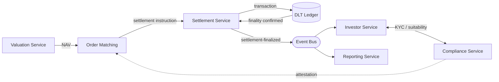
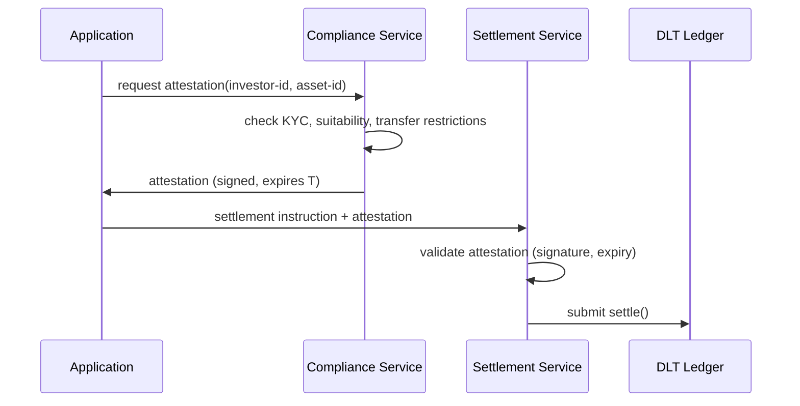
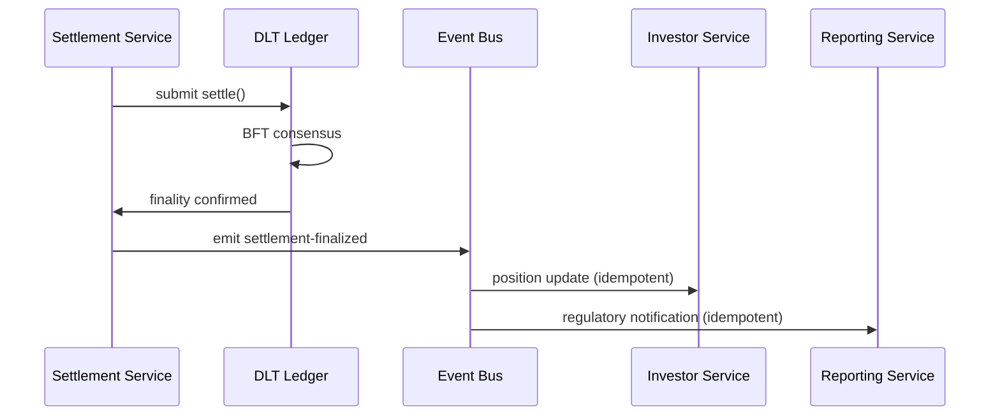

# ADR-003: Service Boundaries in a DLT-Backed Financial Platform

## The Question That Prompted This Decision

The permissioned DLT decision (ADR-001) and the atomic DVP decision (ADR-002)
established the foundational infrastructure: a shared ledger with deterministic
settlement finality. What they did not resolve is how application services decompose
around that infrastructure.

In a monolith, service boundaries are implicit — the call graph determines coupling,
and the database is the single source of truth for all state. When you introduce a
DLT ledger as a settlement layer, you change the premise: the ledger is now an
authoritative source of truth for asset ownership that exists outside your application
database. Your services are no longer the sole authority over the state they manage.
That change makes the standard decomposition question harder.

The question this decision addresses: in a platform where settlement finality is
deterministic and irreversible, compliance rules are regulatory obligations, and
workflows are long-running and asynchronous — where do you draw service boundaries,
and what principles guide those decisions?

---

## Why Standard Microservices Advice Is Incomplete Here

The conventional answer to service decomposition is domain-driven: draw boundaries
around bounded contexts, minimize cross-service data dependencies, let each service
own its data. This is sound but insufficient for this domain. Three properties of this
platform change the analysis.

**Settlement finality without compensation.** The standard pattern for cross-service
consistency in a distributed system is the saga: a sequence of local transactions,
each with a compensating transaction that runs if a later step fails. This works when
all state is mutable. It does not fully work when one of the steps commits a
transaction on a DLT ledger. A settled trade cannot be rolled back — it can only be
corrected by a new opposing trade, which is a different economic event with its own
tax, reporting, and audit implications. Services that interact with settlement state
cannot treat it as mutable application data. The failure modes and recovery paths are
structurally different from the rest of the system.

**Compliance as a cross-cutting concern.** Suitability checks, KYC status, transfer
restrictions, and reporting triggers are not owned by any single business domain —
they apply across every service that touches investor data or asset transfers. The
two naive architectures each have a failure mode. Per-service compliance enforcement
creates divergence risk: when the regulatory surface changes (CVM guidance, ANBIMA
standards update, new BCB interpretation), each service must be updated independently,
and the window between the first and last update is a period of inconsistency. A
central compliance oracle solves the consistency problem but introduces a bottleneck
and a single point of failure. Neither is obviously correct; the right choice depends
on how frequently rules change and how much latency is acceptable in the critical
path.

**Audit trails as regulatory artifacts.** In most systems, logs are operational — they
help you debug, not settle lawsuits. In a regulated financial platform, audit trails
are legally material: who approved a suitability check, when a KYC record was last
updated, what the NAV was at the moment a trade priced. This is not a logging
requirement that can be added later. It shapes which events must flow through which
services, which services must be authoritative for which state, and how long data must
be retained in what form. The design of audit infrastructure is an architectural
constraint, not an operational afterthought.

---

## The Boundaries That Matter

Five service boundaries emerge from these constraints. They are not arbitrary — each
corresponds to a domain where the ownership question has a specific answer that differs
from the others.

**Settlement service.** The single interface between the application layer and the
DLT ledger. This service constructs settlement transactions, submits them to the
network, monitors for finality confirmation, and emits settlement events that downstream
services consume. No other service writes directly to the ledger. This boundary is
load-bearing: it is the point where application state and ledger state must be kept
consistent, and where the failure mode of "ledger says one thing, database says another"
must be explicitly handled.

The settlement service does not own business logic — it does not decide whether a
trade should settle, only how. Eligibility and compliance checks happen upstream, in
the compliance service. The settlement service receives a pre-validated instruction
and executes it.

**Compliance service.** The authoritative source of regulatory rules: suitability
profiles, KYC status, transfer restriction tables, reporting triggers. Other services
query this service before any action with compliance implications. This is the
architectural alternative to per-service compliance: a single service owns the
interpretation of the regulatory surface, and rule updates are deployed once rather
than across every service that happens to enforce them.

The design constraint this creates: the compliance service cannot be a blocking
synchronous dependency in the settlement hot path if settlement throughput matters.
The practical resolution is a certificate model — the compliance service issues
time-bounded compliance attestations that the settlement service validates at
transaction time without a live query. The attestation caches the compliance state;
the settlement service checks the attestation's validity window. This trades
consistency for performance in a controlled way.

**Valuation service.** The authoritative source of NAV for each asset. Valuations
in illiquid markets are slow, asynchronous, and sometimes contested — a CRI's fair
value may depend on a mark from the asset manager, confirmation from a third-party
appraiser, and a final custodian validation. The interface between this service and
everything downstream is a coordination surface worth designing explicitly.

Two questions define this boundary: who can write a valuation (governance), and what
consistency guarantees downstream services get when they read one (freshness). If
multiple services can update NAV without going through the valuation service, the
canonical NAV is undefined. If downstream services read stale valuations without
knowing it, settlement pricing and investor-facing displays diverge. The valuation
service is the answer to both questions — but only if the boundary is enforced.

**Investor service.** The authoritative source of investor state: suitability records,
KYC history, capital call status, distribution history. This is the boundary where
contractual obligations meet internal system state. The consistency requirements here
are higher than in most services because the state is externally observable and legally
material — an investor can dispute a suitability assessment or a capital call record,
and the platform must produce an authoritative audit trail of how that state came to be.

**Order book and matching service.** The price discovery layer. Operationally the most
decoupled service: it matches bids and offers against the order book, but the actual
settlement of a matched trade is delegated entirely to the settlement service via a
settlement instruction. The matching service has no direct interaction with the ledger
and no compliance obligations of its own — those fire at the settlement primitive,
not at the matching step. This decoupling is intentional: matching logic can evolve
independently of the settlement and compliance infrastructure.

---

## The Cross-Service Consistency Problem

With deterministic settlement finality, the standard saga pattern has a specific
failure mode worth naming explicitly. If a settlement transaction commits on the DLT
but the subsequent event that should update the investor service fails (network
partition, consumer crash), the ledger says the investor owns the asset but the
application does not reflect it. This is not a theoretical edge case — it is the
primary consistency failure to design against.

The appropriate pattern is event sourcing at the settlement boundary. The settlement
service emits a settlement-finalized event when consensus confirms the transaction.
Downstream services — the investor service updating positions, the compliance service
updating ownership records, the reporting service triggering regulatory notifications
— consume this event to update their own state. The DLT ledger is the source of
truth; application services maintain eventually consistent projections of that truth.

This design makes the failure mode explicit and recoverable. A missed event can be
replayed from the event log. A corrupted projection can be rebuilt by replaying all
settlement events from the beginning. The audit trail is the event log itself — an
ordered, append-only record of every state transition, which is both the recovery
mechanism and the regulatory artifact.

The constraint this imposes: every consumer of settlement events must handle
duplicate delivery without corrupting state. Idempotency is not optional in an
event-driven architecture where at-least-once delivery is the default.

---

## What This Decision Constrains

**Shared databases are a liability at these boundaries.** If the investor service and
the compliance service share a schema for KYC status, a column rename in one creates a
deployment dependency on the other. Each service must own its persistent state, even
when that means maintaining a read model that duplicates data from another service.
The duplication is the cost of deployment independence.

**The DLT changes the recovery model.** In a traditional architecture, the database
is the source of truth and disaster recovery means restoring from backup. In this
architecture, the DLT ledger is authoritative for asset ownership state. Recovery
procedures must treat the ledger state as canonical and rebuild application state from
it — not restore application state and hope it matches the ledger. This is a
meaningful operational difference that must be reflected in runbooks and DR testing.

**Compliance rule updates are a deployment event across the system.** Even with a
centralized compliance service, a rule change requires deploying the compliance
service, invalidating outstanding attestations, and potentially re-running pending
compliance checks. The compliance service boundary must be designed to support this
without requiring coordinated downtime across dependent services.

**The valuation boundary is the hardest to stabilize.** Illiquid asset valuations
involve human judgment, third-party inputs, and contested marks. The valuation service
boundary is well-motivated, but the interface it exposes — what a valuation is, when
it is final, who can dispute it — reflects domain complexity that will require
iteration as the platform scales and edge cases emerge. Treat this boundary as the
most likely to need revision.

---

## Conclusion

Five service boundaries: settlement, compliance, valuation, investor state, and order
matching. The settlement service is the sole interface to the DLT ledger. The
compliance service is the authoritative source of regulatory rules, accessed via
time-bounded attestations to keep it off the settlement hot path. Settlement events
drive downstream state updates in an event-sourced pattern, making the DLT ledger
the source of truth and application services recoverable projections of it.

The reasoning is not standard domain-driven decomposition applied mechanically. It
follows from the specific constraints of this platform: settlement finality that
cannot be compensated, compliance rules that must be consistent across services, and
audit trails that are regulatory artifacts. The boundaries exist where the ownership
of authoritative state has a specific answer — and each answer is different.

The uncertainty is concentrated in two places. The valuation boundary reflects domain
complexity that will require iteration: the interface between the valuation service
and settlement pricing has consistency requirements that only become clear under real
market conditions. The compliance boundary reflects regulatory uncertainty: CVM 88
and its practical interpretation are still evolving, and the attestation model must
be designed to absorb rule changes without propagating them as deployment events
across the system.
